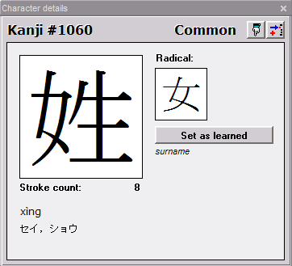

_This page has been ported from the old Wakan help and has not yet been updated. The information may be obsolete_

# Character details window

This window shows detailed information about the selected character.

**How to Access:** **Details** (Ctrl+D) on the **Characters** menu.

## Window controls

  *  - Inserts character at the end of the clipboard.
  * **Set as learned** - Toggles the status of the character between "learned" and "unlearned." Learned characters are displayed in blue in the [character list](KanjiList.md#Character_cards).

The smaller box to the right of the box containing the selected character shows its radical. You can determine which kind of radical is displayed here in the [character list settings](Settings.md#Character_list). If the character has a simplified variant, it is displayed in a second box to the right of the radical. If the selected character is a simplified character, this second box displays the corresponding traditional character.

The lower part of the window displays other kinds of information (including frequency rankings, stroke counts, index numbers, alternate radicals, and encodings). You can customize which details are displayed in [character details settings](Settings.md#Character_details). The types of detailed information which can be displayed here are described below.

Japanese readings can be displayed in kana or in romaji. Chinese readings can be displayed in PinYin/Wade-Giles/Yale or in bopomofo. You can make these choices in [romanization settings](Settings.md#Romanization).

# Kanji details
Detailed information about characters which can be displayed in the Character details window, or used as search criteria in the [Character list](KanjiList.md) window.

The majority of this information comes from KANJIDIC and Unihan databases. For detailed info on how those are built, please refer to:

  * [KANJIDIC documentation](http://www.csse.monash.edu.au/~jwb/kanjidic_doc.html)
  * [Unihan documentation](http://www.unicode.org/reports/tr38/)

### Japanese information

  * **Japanese definition**
  * **ON reading** - "Sound" reading in a Japanese word, in theory deriving historically from a Chinese reading, used mainly in words containing more than one kanji.
  * **KUN reading** - Japanese reading for the root of a word; used mainly when the given kanji is the only kanji in the word.
  * **Nanori readings** - Readings used only in Japanese names of people and places.
  * **Jap. frequency** - A number from 1 to 2501 for the 2501 most frequently used kanji, with 1 for the most common; no number for other kanji.
  * **Jouyou grade** - The grade in the Japanese school system by which a student is expected to know the character. 1-6: grade in grade/middle school; 8: high school/general use; 9: used in names.

### Chinese information

  * **Chinese definition**
  * **Mandarin reading**
  * **Cantonese reading**
  * **Chin. frequency** - Frequency measurement for the character based on analysis of Chinese USENET postings. A number from 1 to 5, with 1 indicating the most common hanzi, 5 the least common.
  * **HongKong grade** - The grade in the Hong Kong school system by which a student is expected to know the character.

### Korean information

  * **Korean reading**

### Structural information
(Used for Dictionary Lookup)

  * **DeRoo Code**
  * **FourCornerCode** - A system developed by Jack Chen for locating characters by shape. [See details below](#FourCornerCode).
  * **SKIP code** - A pattern code developed by Jack Halpern for locating character by shape. Please see the [SKIP instructions and license information](#SKIP).

### Radicals

  * **Radicals** - List of all possible radicals of character
  * **Classical radical** - Stadard / traditional radical.
  * **Bushu radical** - Radical number used in the classic Nelson (not the New Nelson) Character Dictionary ("Modern Japanese-English Character Dictionary")

### Stroke counts
(all but the first are in the form `r.s`, where `r` is the number of strokes in the radical, and `s` is the number of additional strokes, and `'` indicates a simplified version of the radical)

  * **Stroke Count** - Total number of strokes (including the radical)
  * **Unicode radical**
  * **Morohashi radical** - Radical and stroke counts in _Morohashi Daikanwajiten_
  * **KangXi radical** - Radical and stroke counts in _KangXi Zidian_
  * **Korean radical**
  * **Japanese radical**

### Variant forms

  * **Simplified Variant** - Simplified character corresponding to the given character (if one exists).
  * **Traditional Variant** - Traditional character(s) corresponding to the given character.
  * **Z-Variant**
  * **Semantic Variant** - Unicode value for a character with similar or identical meaning which can generally be substituted for the given character.
  * **Compatibility Variant**

### Japanese indexes
Index Numbers in Japanese Dictionaries and Textbooks

  * **Crowley index** - Index number in _The Kanji Way to Japanese Language Power_, by Dale Crowley.
  * **Essential index** - Index number used in P.G. O'Neill's _Essential Kanji_ (ISBN 0-8348-0222-8).
  * **Gakken index** - Index number in the _Gakken Kanji Dictionary_ ("A New Dictionary of Kanji Usage").
  * **Halpern index** - Index number in the _New Japanese-English Character Dictionary_, edited by Jack Halpern.
  * **Haig index** - Index number in _The New Nelson Japanese-English Character Dictionary_, edited by John Haig.
  * **Heisig index** (sometimes **Remembering** index) - Index number in _"Remembering the Kanji"_, by James Heisig.
  * **Henshall index** _A Guide To Remembering Japanese Characters_ (Kenneth G. Henshall)
  * **JBP index** _Japanese for Busy People_ (AJLT, pub.): code is volume.chapter
  * **Kodansha index** _Kodansha Compact Kanji Guide_
  * **Learners index** _Kanji Learners Dictionary_ (Jack Halpern)
  * **Morohashi index** _Morohashi Daikanwajiten_
  * **Nelson index** - Index number in_the Modern Reader's Japanese-English Character Dictionary_, edited by Andrew Nelson.
  * **Nishiguchi&Kono index** _Kanji in Context_ (Nishiguchi and Kono)
  * **O'Neill index** Japanese Names (P.G. O'Neill)
  * **Sakade index** _A Guide To Reading and Writing Japanese_ (Florence Sakade, ed.)
  * **Spahn&Hadamitzky** _The Kanji Dictionary_ (Spahn and Hadamitzky). S&H Kanji & Kana Kanji and Kana (Spahn and Hadamitzky)
  * **Tuttle index** _Reading and Writing Japanese_, _Kanji Cards_, published by Tuttle.

### Chinese indexes
Index Numbers in Chinese Dictionaries and Textbooks

  * **Casey index** - Index number in _Ten Thousand Characters_
  * **Cihai index** - Index number in the _Cihai Dictionary_
  * **HanYu index** - Index number in _Hanyu Da Zidian_
  * **KangXi index** - Index number in _KangXi Zidian_ (classic dictionary)

### Hexadecimal encodings

  * **Unicode** - Hexadecimal Unicode index of the character - a unified system for representing characters in many different languages. More information can be found at http://www.unicode.org.
  * **JIS 0208**- A Japanese encoding.
  * **JIS 0212**- A Japanese encoding.
  * **JIS 0213**- A Japanese encoding.
  * **BigFive**- An encoding used with Traditional Chinese characters.
  * **CCCII**
  * **Cangjie**
  * **EACC**
  * **GB2312** - An encoding used with Simplified Chinese characters.
  * **GB12345** - An encoding used with Simplified Chinese characters.

# SKIP
The System of Kanji Indexing by Patterns (SKIP) is a scheme for the classification and rapid retrieval of Chinese characters on the basis of geometrical patterns. Developed by Jack Halpern, it first appeared in the New Japanese-English Character Dictionary (Kenkyusha, Tokyo 1990; NTC, Chicago 1993), and is being used in a series of dictionaries and learning tools called KIT (Kanji Integrated Tools). SKIP is protected by copyright, copyleft and patent laws.

Commercial usage of SKIP in any form is strictly forbidden without the written permission of Jack Halpern, the copyright holder (jhalpern@cc.win.or.jp).

Details of SKIP usage can be found in KANJIDIC documentation on this page: http://www.csse.monash.edu.au/~jwb/kanjidic_doc.html

# FourCornerCode
Overview of the FourCornerCode is currently not available in this documentation. You can find in KANJIDIC documentation on this webpage:
http://www.csse.monash.edu.au/~jwb/kanjidic_doc.html
