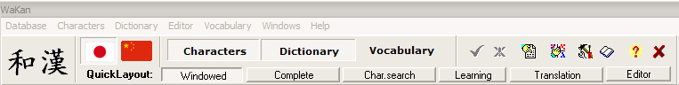
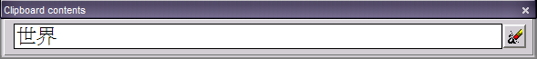
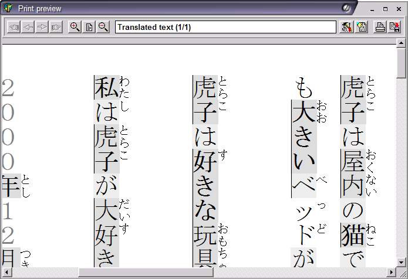
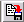

_This page has been ported from the old Wakan help and has not yet been updated. The information may be obsolete_

# Main window

The control panel at the top of the main window has four buttons, labeled Characters, Dictionary, Editor and Translator and Vocabulary. These correspond to the four [main areas](#Areas) of the program], which are described below. Each displays the corresponding tool in the lower part of the main window.

## Menus
The [Database menu](#DatabaseMenu) provides access to the user Settings and the Dictionary Manager. It also provides commands for saving and undoing changes in the user database, and displaying [statistics](#Statistics).

The Characters, Dictionary, Editor and Vocabulary menus provide commands relevant to the corresponding tools (see [below](#Areas)).

The Help menu provides access to this help, and to the "About" page for Wakan.

## Language Selector

  *  - Switches program to Japanese mode.
  *  - Switches program to Chinese mode.

Switching languages alters the entire user interface. The [Character list](KanjiList) displays only characters relevant to the selected language, the [Dictionary Manager](Dictionary#Dictionary_manager) displays  dictionary files only for that language, and the [Vocabulary](Vocabulary) shows only word lists for that language.

## Clipboard viewer

Shows the contents of the Windows clipboard (or the beginning of the contents, if it is too long to fit in the viewer). Many commands in the Wakan can change the contents of the clipboard.

**Note:** Program can handle only UNICODE clipboard format. If you want to paste some data from this program make sure the application supports UNICODE.

  *  - Clears clipboard contents.

# Areas
Main areas of the program:

  * **[Character list](KanjiList)** - The character list can display all of the characters in the database for the selected language, or the results of a [search](KanjiList#Search) for
characters with specified properties. The list can be [sorted](KanjiList#Sort) in various ways, and [detailed information](KanjiDetails) can be displayed for a selected character.
  * **[Dictionary](Dictionary)** - The dictionary window provides the definition for a Japanese or Chinese word, or searches the dictionary for words whose definitions contain an English word
or phrase.
  * **[Editor and translator](Editor)** - Provides an input method (a way of typing words in Roman letters and having them converted to characters) and other features for text editing. In addition, it can display phonetic readings for characters in the context of words, and the meanings of individual words. Integrated dictionary window can be used to translate individual words and to assist in translating longer pieces of text.
  * **[Vocabulary](Vocabulary)** - The Vocabulary Manager maintains word lists for study purposes, and groups them by categories.

# Database menu

  * **Save user changes** (Ctrl+F2): Writes all changes made in [vocabulary](Vocabulary) database to disk.
  * **Cancel user changes** (Ctrl+F3): Cancels all changes in [vocabulary](Vocabulary) database, causing it to revert to the last version saved to disk.
  * **Statistics**: Shows information about the dictionary files, and statistics on information stored in the user database (learned words and characters, vocabulary entries, etc).
  * **Dictionary Manager** (Ctrl+F8): Shows the [dictionary manager](Dictionary#Dictionary_manager) (a utility for managing or importing dictionary files).
  * **Settings**: Shows user preference [settings](Settings).
  * **Change language**: Lets you select Wakan user interface language.
  * **Exit** (Alt+X): Closes the program, and asks whether unsaved changes in the databases or the contents of the editor should be saved.

# Printing

WYSIWYG print preview window.

  *  - Displays first page.
  *  - Displays previous page.
  *  - Displays next page.
  *  - Displays last page.
  *  - Displays smaller portion of page.
  *  - Displays entire page.
  *  - Displays larger portion of page.
  *  - Displays [character cards settings](Settings#Character_cards), [vocabulary list settings](Settings#Vocabulary) or [text translator settings](Settings#Editor) depending on what you are printing.
  *  - Displays printer and page settings dialog.
  *  - Begins printing.
  *  - Saves print into a series of BMP files.