# Settings
You can customize the program in this window.

**How to access:** **Settings** on the **Database** menu.

## Tabs

  * **General** - General program settings.
      * **Romanization** - Preferred romanization system for typing Japanese and Chinese words, and whether latin letters or kana/bopomofo are used for displaying phonetic readings.
      * **Fonts** - Which fonts to use for characters and text in various parts of the program.
      * **Colors** - How to color learned/problematic/rare characters.
      * **Portability** - Where to store program information (lets you make Wakan portable)
  * **Character list** - How characters are displayed in the [Character list](KanjiList.md).
      * **Character details** - Controls the appearance of [Kanji details](KanjiDetails.md) window.
      * **Detail items** - Select the kinds of [character information](KanjiDetails.md#Kanji_details) to show in the [Character details](KanjiDetails.md) window.
  * **Dictionary** - Settings for [Dictionary](Dictionary.md).
      * **Copy formats** - What to copy when you press Ctrl-C in Dictionary
  * **Popup tool**
  * **Editor** - Settings for [text editor](Editor.md)
      * **Saving and loading**
      * **Printing**
      * **Text translator** - Settings for [text translator](Editor.md#Text_translator).
      * **Aozora Ruby** - How to display Aozora Ruby tags in the text
  * **Studying**
      * **Word list printing** - Settings for [vocabulary list](Vocabulary.md) printing.
      * **Character cards printing** - Settings for [printing character cards](KanjiList.md#Print).
  * **Annotations** - Settings for [Annotations feature](Annotations.md).
  * **Database maintenance** - Export/import user database.

# General
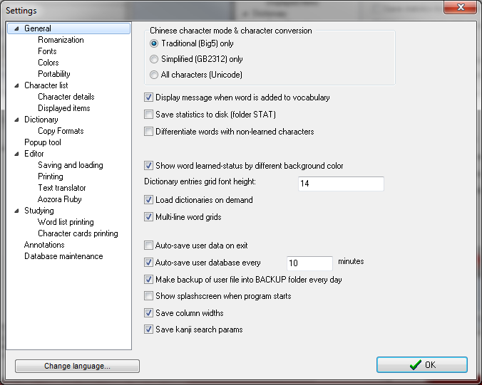

General program settings can be customized here.

  * **Character mode/conversion** - _For chinese mode only:_ Determines how to convert the characters. If **traditional** is selected, then simplified characters will be converted to traditional ones, if **simplified** is selected, then traditional characters will be made into simplified. Otherwise no change will be made and all characters will be shown as is.
  * **Save statistics to disk** - When program statistics is invoked (from the main window), it is also stored to a textfile in folder STAT.
  * **Differentiate words with non-learned characters** - Words that contain characters that are not set as learned (in the [character details window](KanjiDetails.md)) are displayed in gray and the characters are also removed from printed vocabulary list.
  * **Use colors in word grids** - Meaning [markers](Dictionary.md#Markers) are shown in different colors.
  * **Show word learned-status by different background color** - Differentiates word learned state (for vocabulary words) by colors.

  * **Auto-save user data on exit** - if checked, Wakan will save changes to vocabulary and categories automatically, without asking you
  * **Auto-save user database every - minutes** - otherwise Wakan will only save database on exit.
  * **Show splashscreen when program starts** - if unchecked, Wakan just opens directly into main window. Try both and choose what you prefer.
  * **Save column widths** - remember column widths in Dictionary window.
  * **Save kanji search params** - remember last kanji search settings in kanji search window.

# Romanization

Wakan supports several romanization systems. Here you can choose which one or ones to use.

  * **Romanization system** - Preferred romanization system can be set separately for Japanese and Chinese.
  * **Show phonetic in** - Phonetics can be displayed either romanized or in native alphabets (kana for japanese, bopomofo for chinese).
  * **Romanization test** - You can type text in chosen romanization system to test it. It is automatically converted to kana / bopomofo and displayed.

Since Wakan uses internal romanization and de-romanization routines you can type everywhere using latin alphabet, you do not need any IME system installed.

Nearly every edit box where you enter romanized text has a field where you can see the resulting hiragana / katakana / bopomofo text and thus you can make sure the program recognized what you have written.

### Entering japanese words in latin
You are probably familiar with the _Hepburn_ romanization system, which is initally selected. This system is used in all English transcripts from japanese. Apart from _Hepburn_ system, you can use _Kunreisiki_ (Japanese) system or national system used in Czech Republic. Please look at the table below for a brief comparison of the romanization systems and choose the one you prefer.

| Kana | Hepburn | Kunreisiki | Czech |
|:-----|:--------|:-----------|:------|
|  | arigatou | arigatou   | arigatou |
|  | hashi   | hasi       | haši |
| 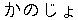 | kanojo  | kanozyo    | kanodžo |
|  | shachou | syatyou    | šačou |
| 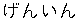 | gen'in  | gen'in     | gen'in |
|  | disuko  | dexisuko   | disuko |

### Entering chinese words in latin
Chinese words can be entered in PinYin, Wade-Giles or Yale system. Tones can be omitted or specified by numbers (please use `5` for neutral tone, not `0`). You can set the preferred system in the romanization settings.

### Custom romanization
Wakan ships by default with a bunch of common romanization systems. You can download additional ones to support your script or language.

Romanization systems are stored in Wakan folder as files with `.roma` extension. Someone may have created a romanization system you want and shared it on the internet.

You can also make your own system - see [Custom romanization systems](CustomRomaji.md)

### Multiple romanization systems
You can choose one or multiple romanizations to be active. To choose multiple, check the "Multiple" checkbox then mark all appropriate systems in the list.

Note that you can move romanization systems with "up" and "down" buttons. Romanization systems higher in the list will be given preference.

You can always try the chosen configuration in "Romanization test" box. If you're confused and just want everything to work, uncheck the "Multiple" checkbox and select a single romanization system.

# Fonts
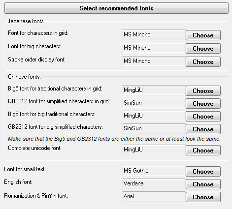

Here you can choose all the fonts used in the application.

**Warning:** It is highly recommended that you let the program select all fonts by pressing the **Select recommended fonts** button. This way a high quality font display is guaranteed. If you select fonts manually you may experience some problems, like missing, bad quality or misplaced letters.

### Manual font selection
**Warning:** You should make sure that the chosen fonts support the relevant Unicode character range:

  * Japanese fonts must support _Katakana_ & _Hiragana_ ranges as well as approximately 6,000 characters commonly used in Japan from the _CJK Unified Ideographs_ range.
  * Chinese fonts must support all characters either from the _GB2312_ or _Big5_ character sets, for maximum compatibility they should support whole _CJK Unified Ideographs_ range (about 22,000 characters).

If you are unable to confirm that the fonts you want to select meet these criteria, please use only recommended fonts (see below).
More information about character ranges can be found at [www.unicode.org](http://www.unicode.org).

You can select different fonts for Japanese mode and for Chinese mode (traditional and simplified fonts are also selected separately).

  * **Font for characters in grid** - Fonts that will be used almost everywhere in the program, most importantly in the [character list](KanjiList.md) window.
  * **Font for big characters** - Font for [character details](KanjiDetails.md) window.
  * **Font for small text** - Main font for dictionary entries.
  * **Complete Unicode font** - Font that supports whole _CJK Unified Ideographs_ range. It is used mainly for displaying radicals.
  * **Romanization and english font** - Font for text in latin.

# Colors
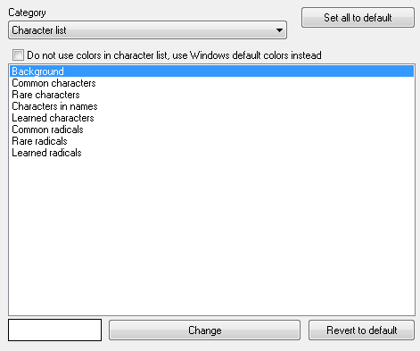

# Character list
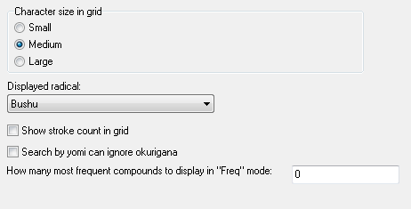

Settings for the [character list](KanjiList.md).

  * **Character size in grid** - Displayed size of characters in grid.
  * **Radical type** - Determines whether to use classical radicals or "modern" radicals (Bushu for japanese, KangXi for chinese). Modern radicals are in many cases more predictable, however many dictionaries are ordered by the classical radicals.
  * **Show stroke count in grid** - Displays stroke count as a small number in the upper-left corner of each character.

## Character details
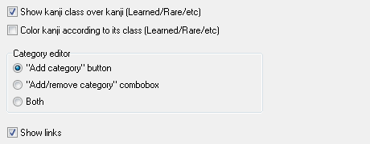

## Detail items

# Dictionary
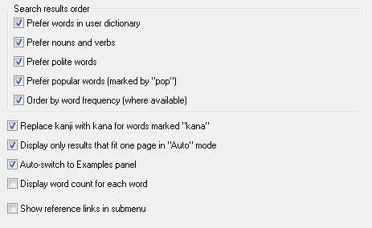

Settings for [dictionary](Dictionary.md).

  * **Search results order** - Contains several options that affect sort order of dictionary results.
  * **Replace kanji with kana for "kana" words** - Written form for words that contain "kana" [marker](Dictionary#Markers) will be replaced with kana.
  * **Auto-convert words to non-inflected forms** - Allows to search for inflected words. For example word `hatarakimasu` will be located if this option is checked.

## Copy formats
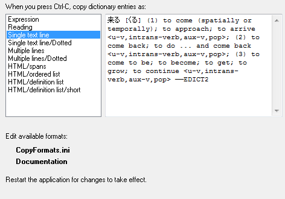

# Popup tool
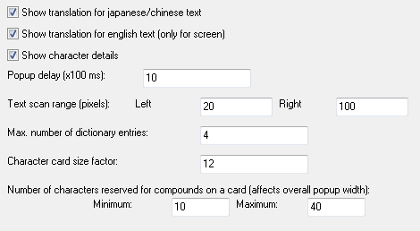

# Editor
Settings for [text editor and translator](Editor.md).

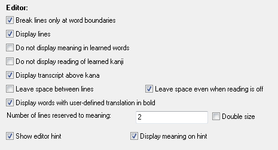

  * **Break lines only at word boundaries** - Since text translator writes meaning under the words it is more reasonable to break lines at word boundaries even though japanese text normally isn't.
  * **Display lines** - Uses lines to separate words.
  * **Do not display meaning in learned words** - Hides meaning for words that are in user [vocabulary](Vocabulary.md) and are set as learned.
  * **Do not display reading of learned kanji** - Hides reading for characters that are set as learned (can be changed in [character details](KanjiDetails.md)).
  * **Display transcript above kana** - Displays hiragana reading above katakana words, or romaji transcript above all kana (if reading is configured to be in romaji).
  * **Leave space between lines** - Leaves more space between text lines.
  * **Display words with user-defined translation in bold** - Words that are in user [vocabulary](Vocabulary.md) and are displayed in bold.
  * **Number of lines reserved to meaning:** - Number of lines of meaning that will appear under words.
      * **Double size** - Meaning will be the same size as the main text (it's half that size by default).

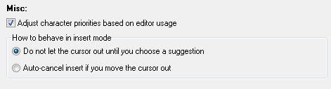

  * **Adjust character priorities based on editor usage** - if checked, Wakan remembers your choices in an editor suggestion box, and next time gives preference to words which you previously chose. On the other hand, this may make Wakan ask you to "Save user data" every time you just typed something in the editor.
  * **How to behave in insert mode** - when you type a word and a suggestion box pops up, and then, without accepting the suggestion, you click somewhere else - this is what Wakan should do. Either:
      * **Do not let the cursor out until you choose a suggestion** - You cannot move the cursor elsewhere, it's locked.
      * **Auto-cancel insert if you move the cursor out** - The suggestion disappears, your input is left as it is, in kana. The cursor jumps wherever you clicked.

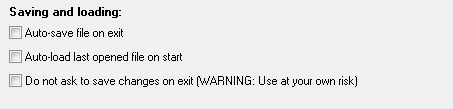

  * **Display reading** - Display reading (furigana) in printed text.
  * **Display meaning** - Display meaning (translation) in printed text.
  * **Do not use colors** - Uses only shades of grey in printed text (for B&W printers).
  * **Print vertically in columns** - Text is printed vertically from right to left.
  * **Number of lines on square page** - Number of lines of text that will appear on square page. On rectangular page the number may vary.

  * **Do not search for particles** - Will not try recognize particles.
  * **Do not translate hiragana-only words** - Will not try to locate meaning for hiragana-only words.
  * **Do not warn when translating large text blocks** - By default Wakan warns you when you try to auto-translate a large block of text because this can take time. If on your PC this is fast (as it is on most PCs these days) you may want to disable this warning.
  * **Multithreaded translation** - Use all your processor cores to translate faster. There's usually no reason to disable this, maybe only as a thing to try if auto-translation crashes.

  * **Show Aozora-Ruby as annotations** - Enable Aozora-Ruby, common way of storing ruby (readings) in Japanese electronic books. Aozora-Ruby will be displayed as normal Wakan translations.
  * **Show Aozora-Ruby tags in color** - Color some Aozora-Ruby tags (e.g. ``) in gray as they are not part of the text. The color can be changed on Colors page.
  * **Save annotations as Aozora-Ruby tags by default** - Wakan translations/readings can be saved in text format as Aozora-Ruby tags. Then any Japanese book viewer will show them above or besides the character, just like Wakan does. If this is checked, then Wakan will do this by default (otherwise you can still request this manually).

# Word list printing
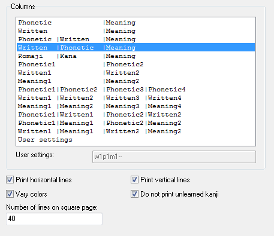

Settings for printing the [vocabulary list](Vocabulary.md).

  * **Columns** - What columns will appear in the printed list. If you select "User settings", you can type in the edit box your own 8-character long column settings: each column corresponds to two characters in the string, first identifies the contents of the column (m=meaning, w=written, p=phonetic, r=romaji, k=kana) and the second is the order of the data. You can also type `--` to prolong the preceding column. Please take care with entering user settings, program does not handle well strings in invalid format.
  * **Print horizontal lines** - Prints row separating lines.
  * **Print vertical lines** - Prints column separating lines.
  * **Vary colors** - Shades odd rows.
  * **Do not print unlearned characters** - Words that contain characters that are not set as learned (in the [character details window](KanjiDetails.md)) won't have printed written form.
  * **Number of lines on square page** - Number of rows that will appear on square page (on rectangular page the actual count may vary).

# Character cards printing
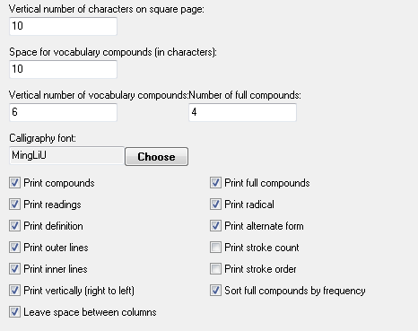

Settings for [printing character cards](KanjiList.md#Character_cards).

  * **Vertical number of characters on square page** - Number of characters that will appear vertically on square page. On a rectangular page the number may vary.
  * **Space for compounds** - Horizontal number of characters reserved for compounds. Influences card width.
  * **Vertical number of compounds** - Vertical number of characters reserved for compounds. Since the height of the card is fixed, this influences also the size of the font for readings & meaning.
  * **Calligraphy font** - Font used for the big character on the card.
  * **Print compounds** - Compounds will be printed on card.
  * **Print radical** - Radical will be printed on card.
  * **Print compounds** - Compounds will be printed on card.
  * **Print reading** - Readings will be printed on card.
  * **Print alternate form** - The character in standard font will be also printed on card.
  * **Print definition** - Meaning will be printed on card.
  * **Print stroke count** - Stroke count will be printed on card.
  * **Print outer lines** - Lines separating the cards will be printed.
  * **Print inner lines** - Lines inside the cards will be printed.
  * **Print vertically** - First character will appear on top right corner.
  * **Leave space between columns** - More space will be left between columns.

# Database maintenance
Database settings.

  * **Export user database** - Exports [vocabulary](Vocabulary.md) database into special [text format](FileFormats.md#CSV_vocabulary_export).
  * **Import user database** - Imports [vocabulary](Vocabulary.md) database from special [text format](FileFormats.md#CSV_vocabulary_export).
  * **Check user dictionary categories** - Checks whether all words are in at least lesson [category](Vocabulary.md#Categories) and exactly one group category.