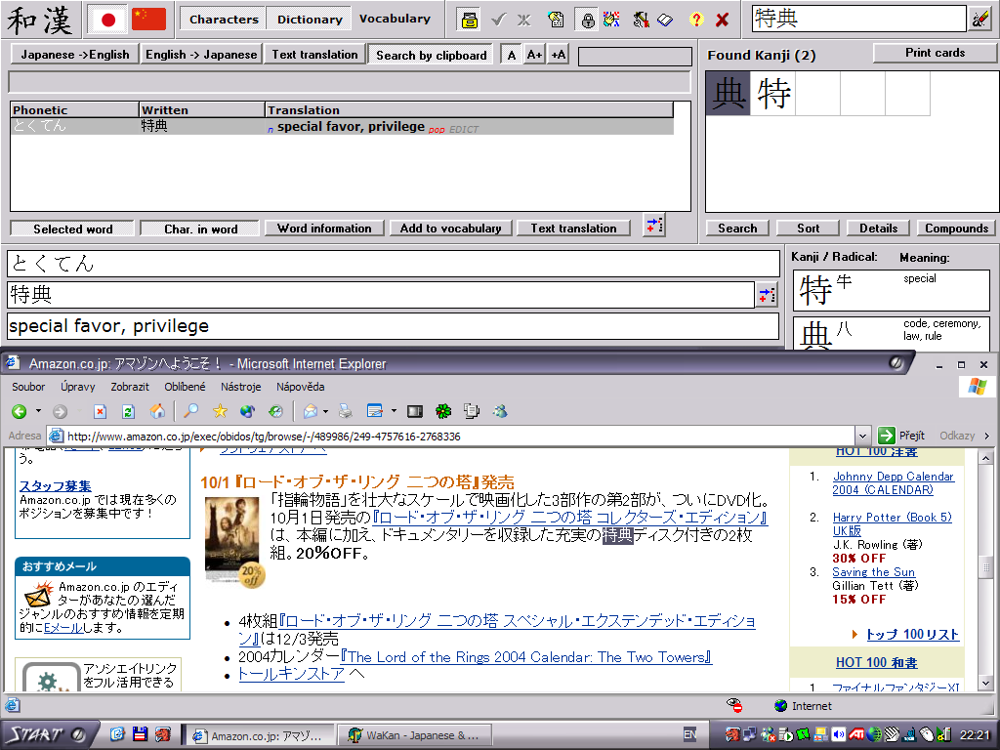

_This page has been ported from the old Wakan help and has not yet been updated. The information may be obsolete_

# Text editor

This utility serves as a text editor and assists in translating text from Japanese or Chinese to English. Its features include an input method (converts syllables typed in Roman letters to characters), recognizing word boundaries (only available in Japanese, not in Chinese) and printing vertical text with furigana and meaning. It can be very useful for reading web pages or written text.

**How to access:** **Editor** button on the main control panel, or **Editor window** (Ctrl+E) on the **Editor** menu. (Also appears in part of the main window when **Translator** button on the main control panel is pressed.)

**Quick tip:** After loading Japanese or Chinese text, press **Fill** button to fill reading and meanings.

**Warning:** Only active dictionaries are searched. You can specify which dictionaries are active in the [dictionary manager](Dictionary#Dictionary_manager).

## Window controls
  *  - Loads text for translation from 16-bit Unicode file or from a special application format that already contains translation information.
  *  - Saves text into 16-bit Unicode file or into special application format with the translation information.
  *  - Kanji mode (converts kana to kanji).
  *  - Kana mode (disables kanji conversion).
  *  - ASCII mode (writes ASCII text).
  *  - Toggles furigana display.
  *  - Toggles displaying meaning under text.
  *  - Deletes translation information from whole text.
  *  - Automatically fills reading and meaning to whole text. Program tries to locate every word of the text in the dictionary and stores its reading and meaning. Located words are displayed in different colors (see below). This process can be configured in the [settings](Settings#Editor).
  *  - Sets the translation of the currently selected word in text to the currently selected word in dictionary.
  *  - Displays [print preview](MainWindow#Printing) window with the currently loaded text. Furigana and meaning can be printed too. Text can be printed vertically (right-to-left). All of this can be configured in [settings](Settings#Editor).

## Colors in translated text
  * **White** - Untranslated word.
  * **Red** - Word which was not found in dictionary.
  * **Yellow** - Translated word.
  * **Orange** - Translated verb.
  * **Blue** - Estimated particle.
  * **Cyan** - Hiragana-only word.
  * **Violet** - Katakana-only word.

# How to write Japanese text
You can freely write text in hiragana or katakana in the editor window. Text entered in romaji is automatically converted to kana using the current [romanization settings](Settings#Romanization). See [romanization tips](Settings#Romanization) for more info. Text written UPPER-CASE is converted to katakana, text written in lower-case is converted to hiragana. Whenever you press SPACE the last entered text is converted to kanji of currently selected word in [dictionary](Dictionary) (you can change the selection by up and down arrow keys). By pressing ENTER you leave the text as it is performing no conversion.

## Keyboard summary

  * **SPACE** - Convert lastly entered word (shown in blue) to kanji.
  * **ENTER** - Perform no conversion to lastly entered word.
  * **UP/DOWN ARROW** - Change currently selected word in dictionary (to alter the conversion).

## Example
**This tutorial will show you how to write the sentence**
> `watashi ha hon wo yomimasu ga, terebi wo mimasen.`

  1. Open the editor window and select kanji mode (by pressing button ).
  1. Type `watashi`. Note that the text is displayed in hiragana (since you typed it in lowercase) and that it is coloured blue (because it is not yet converted to kanji).

    

  1. Press SPACE. Watashi is then converted to kanji.

    

  1. Type `ha` and press SPACE. Program identifies it as a particle and displays it in a different color.

    

  1. Type `hon`, press SPACE to convert it and type `wo` and SPACE for the particle.

    

  1. Type `yomimasu` and SPACE for conversion. Note that WaKan can handle inflected words and also that it is displayed in different color because it is a verb. If you meant yomimasu as to recite, you must press DOWN ARROW before the conversion to change the actual verb in dictionary.

    

  1. Type `ga,`. You don't need to press SPACE before the comma because WaKan can automatically identify the word has ended.

    

  1. Type `TEREBI` or `terebi` and SPACE. If you are entering katakana words that are not in dictionary you must type it in upper-case, however terebi is common and program converts it to katakana automatically.

    

  1. Type `wo mimasen.` to finish the sentence.

    

# Tips

## Translating a web page
You can open the [dictionary](Dictionary) window, select **Search by clipboard**, leave the window open. Then you can select some text on the web page, put it into the clipboard and immediately see the word translation (without even clicking on Wakan window). See the screenshot below.

## Translating a Japanese text document
You can load Unicode text document into text translator and use the **fill** function to fill meaning and reading to words in the text. Then you can print the document with furigana and meaning. You can also click on any word in the text to automatically display all dictionary matches (and correct the automatically filled meaning).