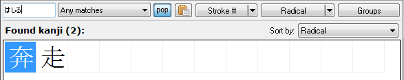
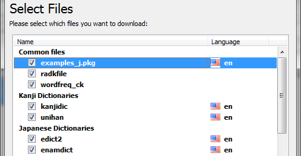

Wakan is a versatile tool for students of Japanese or Chinese. It features a character dictionary, a word dictionary, a text editor, a vocabulary management utility, many printing options (character flashcards, vocabulary lists, text including furigana), and a text translation tool. Wakan will help you to read real Japanese or Chinese text with minimum knowledge of characters and vocabulary.

This is the continuation of the [older Wakan project](http://wakan.manga.cz). Many bugs were fixed, user experience improved and features added - see **[Changes](Changes)**.

Wakan can be installed or used as a portable app. It can be installed over version 1.67, though it's recommended that you uninstall 1.67 first (settings and data will be preserved).

**[All downloads](https://drive.google.com/folderview?id=0B0jSbSrihj-yRDN4WlJXS05BOVE&usp=sharing#list)**

**[Latest version: 1.98.1](https://drive.google.com/open?id=12o8-D1MQ8i8g_PpIxD-Y007v1QZjqZSm)**

 * Fixed Pinyin and Bopomofo tones display
 * Added Palladium cyrillization of Chinese
 * Modern font support (Meiryo, Yu Mincho/Gothic and others)
 * Redesigned kanji search panel

    

 * [Dictionary and component downloader](Docs/Downloader.md) with auto-import

    

**[History of changes](Docs/Changes.md)**

**[Additional dictionaries](https://drive.google.com/folderview?id=0B0jSbSrihj-yVmtxMll3aEw0RVE&usp=sharing#list)**

  * You can import any EDICT/CCEDICT-style dictionary.
  * Some dictionaries [are available for download](https://drive.google.com/folderview?id=0B0jSbSrihj-yVmtxMll3aEw0RVE&usp=sharing#list) (English, German, Russian)

**[Documentation](Docs/HelpContents.md)**

* [Search for a word in dictionary](Docs/Dictionary.md#Dictionary)

* [Look up unknown characters](Docs/KanjiList.md#Search_tips)

* [Edit texts](Docs/Editor.md#How_to_write_Japanese_text)

* [Configure your preferred romanization](Docs/Settings.md#Romanization)

* [Tips and cool things you can do with Wakan](Docs/Tips.md)

### License
The program itself is free and open source. However it uses dictionaries and character databases covered by separate licenses. For details, please see [copyright and license information](Docs/Copyright.md).

### Links
* [Original Wakan site](http://wakan.manga.cz)
* [Original Wakan forums](http://wakan.manga.cz/forum/)

### Building
Go to [/Build](/Build), read readme. Install prerequisites and run build.cmd to produce the app and the installer.

